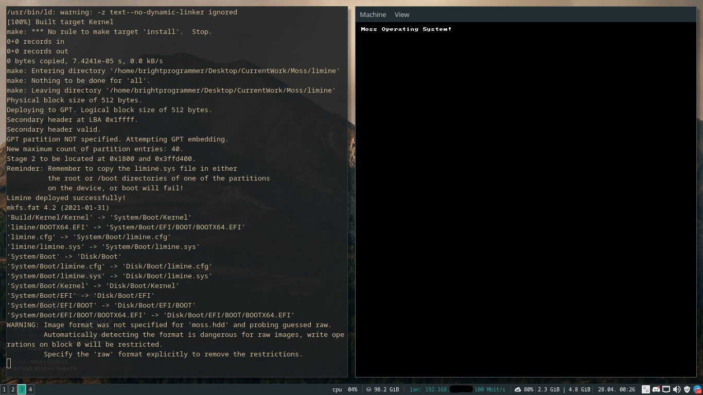
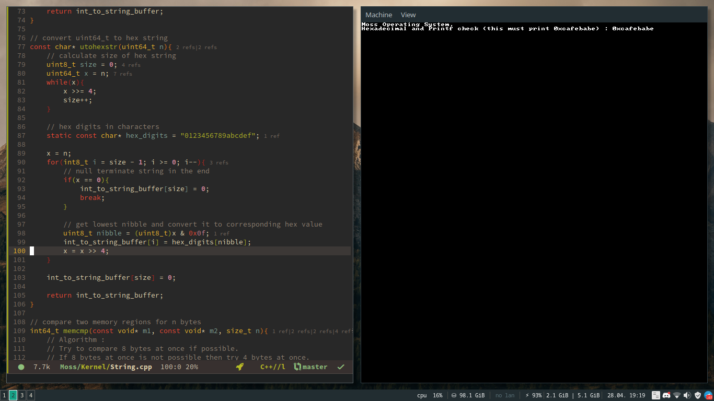

# Moss Operating System

A hobbyist operating system written from scratch. A rewrite of MisraOS basically.
Trying a less object oriented approach this time. I also hope that this will
help me with my CSERL Bootcamp on Operating Systems with IIT Bombay starting from
16th May 2022. Even though they'll be working with xv6 operating system, I'd like to
work on my own parallelly and apply the learned concepts.

Below is a log of how this OS changes through time. I'll try to make a habit of
taking a screenshot and uploading it on every new manjor feature added.

- First successful boot on 04/27/2022
(No SS available :-)

- First print to screen on 04/28/2022

At this stage, most of the code was copy pasted (with little to no modification)
from MisraOS. Writing MisraOS was really helpful. It might be possible that
one day when my workload is too high, I'd give up working on this OS too but then
when I get time, I'll either continue working again or just rewrite a better one
frome scratch again! afterall my journey just began ;-)

- Added kernel printf support on 04/28/2022

Logo source : [Moss icons created by Freepik - Flaticon](https://www.flaticon.com/free-icons/moss)
